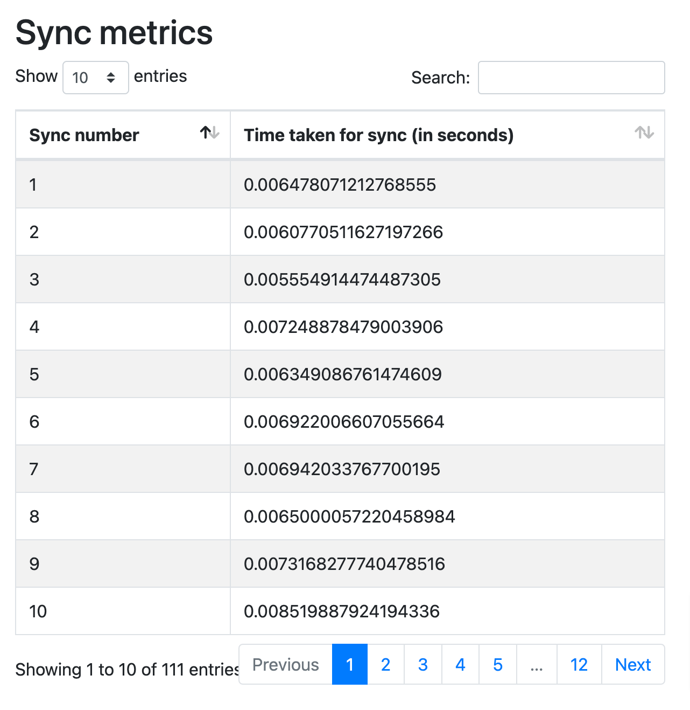
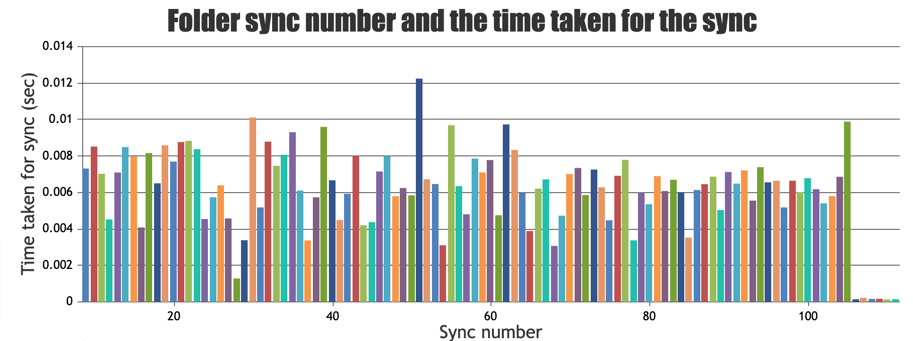

# folder-sync
One-way periodic folder synchronization between source and replica folder

## Table of contents

- [Pre requisite](#pre-requisites)
- [How to use folder sync?](#how-to-use-folder-sync?)
- [Test Cases](#test-cases)
- [Documentation](#documentation)
- [Metrics](#metrics)

## Pre-requisite
Install `python` or `python3`, additionally, install `pytest` to execute and verify the test cases.

## How to use folder-sync?
The folder-sync operates in command line and it takes three command line arguments, those are

 1. Source folder - for which the replica has to be created
 2. Log file - all the folder sync operations are tracked and logged
 3. Sync interval - the periodic interval of which the folder sync operation need to be done

### Steps to run folder sync
**Step-1:**
    `git clone https://github.com/menakadevisundaramoorthy/folder-sync.git`

**Step-2:**
    `cd folder-sync`

**Step-3:**
    `python folder-sync.py [PATH_TO_SOURCE_FOLDER] [PATH_TO_LOG_FILE] [SYNC_INTERVAL_IN_SECONDS]`

If the log file is not available, in the location, then it creates one. If the source folder is not available in the specified location, folder-sync throws error and synchronization does not occur.

## Test Cases
Unit test cases for this functionality is covered very basic file/folder operations. Run the command `pytest` to see the results. And ofcourse, there is scope for improving that. 

## Documentation

Before implementing folder-sync, some research is done and finally concluded that synchronization are generally in two forms, initial sync and delta sync (delta changes). To do this, a variable `LAST_SYNC_TIME` is used. During initial sync, all the files and folders are created in the target folder and in delta sync, only the files/folders that are changed after the last successful execution time will alone be synchronized. This will reduce the time for consecutive syncs and considered to be the most efficient and performant way of sync.

### Implementation notes

 - *No target folder in input:* the name `_replica` appending the source folder name is considered to be the target folder. eg. if source folder is `/tmp/test`, then the replica folder is at the same location `/tmp/test_replica` 
 - *Rename file/folder operations:* folder-sync does not perform rename operations the target folder if the source files/folders renamed. Rather, it deletes the target and re-creates the renamed content again. This could be improved in future.
 - *Log file:* operations are logged in the provided log file path with date, time, log level and message or exception.
 - *Metrics:* Time taken for every sync is recorded to a csv file and the results are displayed in a html file. However, more metrics like, number of files added, removed, etc could be added in future. 
 
 ## Metrics
 Folder sync metrics are capture in a csv file which is git ignored in the `meta` folder. The meta folder contains additional or metadata information about  folder-sync operations. A .html and .js file is used to represent the metrics that are captured during folder-sync operations. To verify the metrics, run the command `python metrics_manager.py`. This will create a temp.html file in meta folder and opens the folder in your default browser. Following are some of the ways the metrics are represented:
### Sync metrics table

### Sync metrics chart

CanvasJS trail version is used for this but it is not for any official use and only for self use. As this repo belongs to me, I have chosen the trail version which is free for self use. 

More metrics like this could be added in the future. Metrics like number of files/folders affected in each and every sync, number of file deleted, created and number of folders created and deleted. Considering the time, only the time take for every sync is done. 